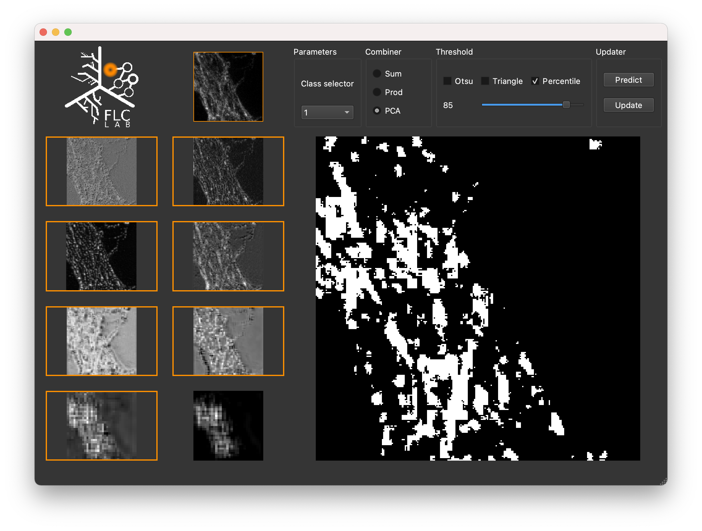

# MICRA-Net : Visualization app

This app is intended to provide the user with a tool to quickly visualize the predictions of MICRA-Net on a given dataset and play with the thresholds. This is not intended to batch process images or save the segmentation results.

Here's a screen shot of the developed application. The application interface may vary depending on the OS.

<div align="center">
    </img>
</div>


# Requirements

The application is built using `PyQt5` which is a large library. For this reason, the library is not included in the default requirements of the repository.

To install the library, we however provide the user with a `requirements-wqt.txt` which contains the right version of `PyQt5` to install. The user may use pip install with the following options to install `PyQt5`

```bash
pip install -r requirements-wqt.txt
# OR
pip install pyqt5
```

# Documentation

In the following, it is assumed that the user launched the `main.py` file from the `src` folder.

To launch the application, the user should navigate to the `app` folder of the MICRA-Net repository. Assuming that `PyQt5` is installed, the user may launch the application using

```bash
python main.py
```

The following documentation provides steps to segment an image from a pretrained model and the functionalities of the application.

## Segmentation

Here are the steps to infer an image from a model:

1. Load a model.

    Click on `File/Load Model` and select the desired `XZooModel.hdf5`. The models should be located within `~/Downloads/MICRA-Net/models`.

1. Load an image.

    Click on `File/Load Image` and select the desired image. Some test images are provided within each `data` folder of the different datasets in the `src` directory

1. Predict.

    Click on the `Predict` button.

1. Change prediction class.

    Click on the `Class selector` dropdown button and select the desired class. Once the right class is selected, the user should be able to see the grad-CAMs of the different layers.

1. Segment.

    Select the desired layers. An orange line should be visible after clicking on the image. Click on the `Update` button to visualize the flattening of grad-CAMs. In the `Threshold` tab, select the desired method. The percentile may be modified by using the provided slider.

## Functionalities

#### Zoom loaded image

To zoom on the loaded image, the user should click on the image. An orange square should be visible within the image depending on the image size. The size of the orange square corresponds to the region which will be predicted by MICRA-Net.

#### Zoom grad-CAMs

To zoom on the grad-CAMs, the user right-click the desired grad-CAM. This should open a popup window the user may resize appropriately.

#### Change prediction coordinates

Following the click on the loaded image, the user may click on the popup image to change the coordinates of the prediction which are given by the orange square.
